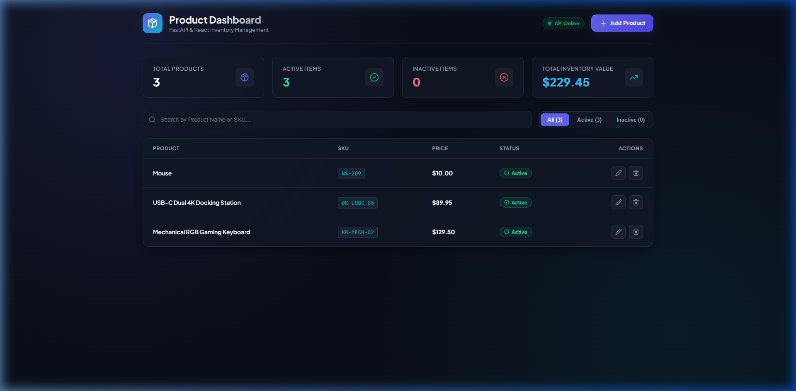
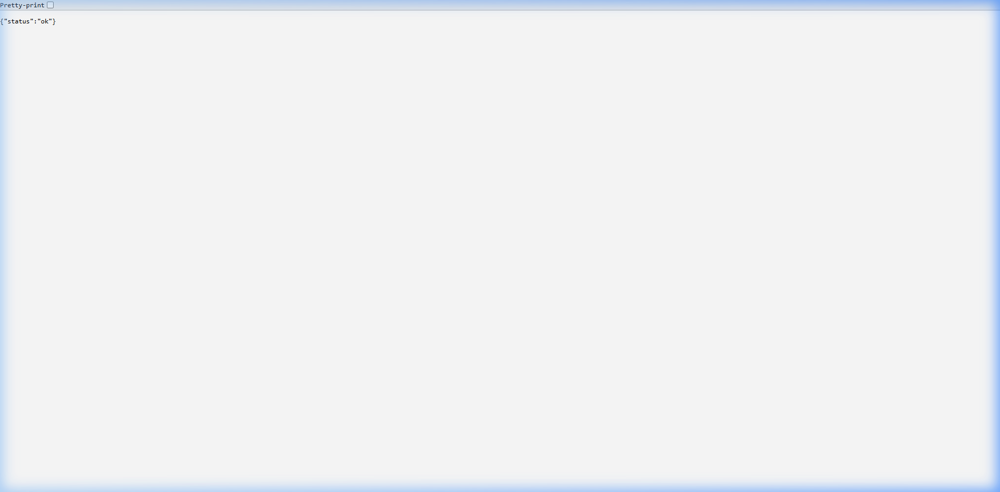
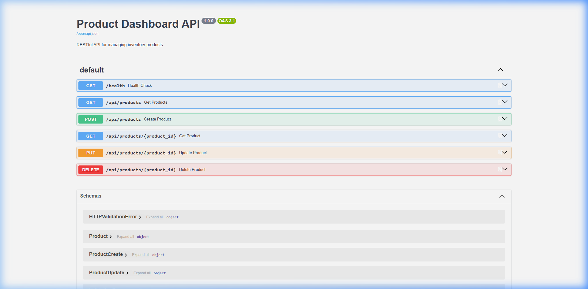

# 📦 Product Inventory Dashboard

A modern, full-stack **Product Inventory Management Dashboard** built with **FastAPI**, **React (Vite)**, **SQLModel (SQLite)**, and **Docker Compose**.



---

## 💡 What is this App?

The **Product Inventory Dashboard** is an enterprise-grade full-stack web application designed to help store managers and businesses track, organize, and manage product inventories efficiently. It provides a real-time responsive dashboard to monitor inventory metrics, search products instantly, and perform full CRUD (Create, Read, Update, Delete) operations seamlessly.

---

## 📸 Screenshots & API Previews

### 🖥️ Frontend Dashboard


### 💓 Backend Health Check Endpoint (`/health`)


### 📚 Interactive Swagger API Documentation (`/docs`)


---

## 🎯 Why Was This Built?

Managing inventory manually or using static spreadsheets often leads to data inconsistencies, duplicate SKUs, and poor visibility into stock values. This application solves those problems by providing:
- **Instant Insights**: Live calculation of total inventory monetary value and active/inactive product distributions.
- **Data Integrity**: Automated server-side validation preventing blank fields, negative prices, and duplicate SKUs.
- **Data Durability**: Persistent storage using Docker volumes so database records survive container restarts and updates.
- **Production-Ready Architecture**: High-performance Nginx reverse-proxying coupled with an asynchronous FastAPI engine.

---

## ✨ Key Features

- 📊 **KPI Metrics Header**: Real-time stats calculating Total Products, Active Items, Inactive Items, and Total Valuation.
- 🔍 **Instant Search & Tab Filters**: Filter items on-the-fly by Product Name, SKU, or Status (*All*, *Active*, *Inactive*).
- ⚡ **Full CRUD Functionality**:
  - **Create**: Add new products with live inline form validation.
  - **Read**: View structured product listings with status badges and monospaced SKU tags.
  - **Update**: Edit existing product details via modal dialogs.
  - **Delete**: Safely delete products with modal confirmation dialogs to prevent accidental removal.
- 🛡️ **Robust Validation & Error Handling**:
  - Live client-side input validation for required fields, min lengths, and valid pricing.
  - Server-side unique SKU collision detection returning `HTTP 409 Conflict` errors.
  - Toast notification popups for instant visual feedback.
- 🐳 **One-Command Dockerization**: Containerized using multi-stage Docker builds and Docker Compose for zero-config deployments.

---

## 🏗️ Architecture Overview

```text
  [ User Browser / Web Client ]
                │
                │  (HTTP Port 5173 / 80)
                ▼
   ┌─────────────────────────┐
   │      NGINX SERVER       │  <-- Serves React static build files (HTML/CSS/JS)
   └────────────┬────────────┘
                │  (Proxies /api/* calls internally to backend:8000)
                ▼
   ┌─────────────────────────┐
   │     UVICORN SERVER      │  <-- ASGI Python application server
   └────────────┬────────────┘
                │  (Executes app.py routes & Pydantic validation)
                ▼
   ┌─────────────────────────┐
   │   FASTAPI + SQLMODEL    │  <-- Database ORM & REST API layer
   └────────────┬────────────┘
                │  (Reads/writes persistent volume /data/products.db)
                ▼
   ┌─────────────────────────┐
   │  SQLITE DATABASE VOLUME │  <-- Persistent Docker volume (product-data)
   └─────────────────────────┘
```

---

## 🚀 Quick Setup & Run (Docker)

### 1. Prerequisites
Ensure you have [Docker Desktop](https://www.docker.com/products/docker-desktop/) installed and running.

### 2. Environment Configuration
Clone the repository and create your local environment file:
```bash
cd product-dashboard-starter
cp .env.example .env
```

### 3. Launch the Stack
Start the backend, frontend, and database volume with a single command:
```bash
docker compose up --build
```

### 4. Access Services & Visual Previews

- 🖥️ **Frontend Dashboard**: [http://localhost:5173](http://localhost:5173)
  

- 💓 **Backend Health Check**: [http://localhost:8000/health](http://localhost:8000/health)
  

- 📚 **Interactive Swagger API Docs**: [http://localhost:8000/docs](http://localhost:8000/docs)
  

---

## 💻 Local Development (Without Docker)

If you prefer to run the application locally without Docker containers:

### 1. Backend Setup
```bash
# Create and activate virtual environment
python -m venv .venv
.\.venv\Scripts\activate

# Install dependencies
pip install -r backend/requirements.txt

# Start Uvicorn backend server
uvicorn backend.app:app --reload --port 8000
```

### 2. Frontend Setup
```bash
# Navigate to frontend directory
cd frontend

# Install node packages
npm install

# Start Vite dev server
npm run dev
```

---

## 🔌 API Endpoints Reference

| Method | Endpoint | Description | Validation & Payload Rules |
|---|---|---|---|
| `GET` | `/health` | Service health check | Returns `{"status": "ok"}` |
| `GET` | `/api/products` | List all products | Supports query params `?search=...` and `?status=...` |
| `GET` | `/api/products/{id}` | Get single product | Returns product details or `404 Not Found` |
| `POST` | `/api/products` | Create product | Body: `{ name, sku, price, status }`. Requires unique SKU. |
| `PUT` | `/api/products/{id}` | Update product | Body: `{ name, sku, price, status }`. Validates SKU collision. |
| `DELETE` | `/api/products/{id}` | Delete product | Permanently deletes product by ID |

---

## ⚙️ Environment Variables

| Variable | Default Value | Description |
|---|---|---|
| `BACKEND_PORT` | `8000` | Exposed host port for the FastAPI backend service |
| `FRONTEND_PORT` | `5173` | Exposed host port for the React / Nginx frontend dashboard |
| `DATABASE_URL` | `sqlite:////data/products.db` | Database URI connection string for SQLModel |

---

## 📁 Project Structure

```text
product-dashboard-starter/
├── backend/
│   ├── app.py              # FastAPI application, models, routes & database seeding
│   ├── requirements.txt    # Python dependencies (FastAPI, Uvicorn, SQLModel)
│   └── Dockerfile          # Python 3.12-slim container configuration
├── frontend/
│   ├── src/
│   │   ├── App.jsx         # Dashboard UI, KPI stats, CRUD modals & Toast system
│   │   ├── main.jsx        # React entrypoint
│   │   └── index.css       # Custom design system & glassmorphism theme
│   ├── nginx/
│   │   └── default.conf    # Nginx config serving static files & proxying /api/
│   ├── package.json        # Frontend dependencies (React, Vite, Lucide-React)
│   ├── vite.config.js      # Vite build & local proxy settings
│   ├── index.html          # HTML shell & font definitions
│   └── Dockerfile          # Multi-stage build (Node 20 build -> Nginx runner)
├── dashboard_preview.png   # Dashboard UI preview screenshot
├── api_health_preview.png  # API Health endpoint (/health) screenshot preview
├── api_docs_preview.png    # Interactive Swagger Docs (/docs) screenshot preview
├── .env.example            # Environment template
├── .env                    # Local environment config
├── docker-compose.yml      # Orchestration for frontend, backend & data volume
└── README.md               # Project documentation
```
